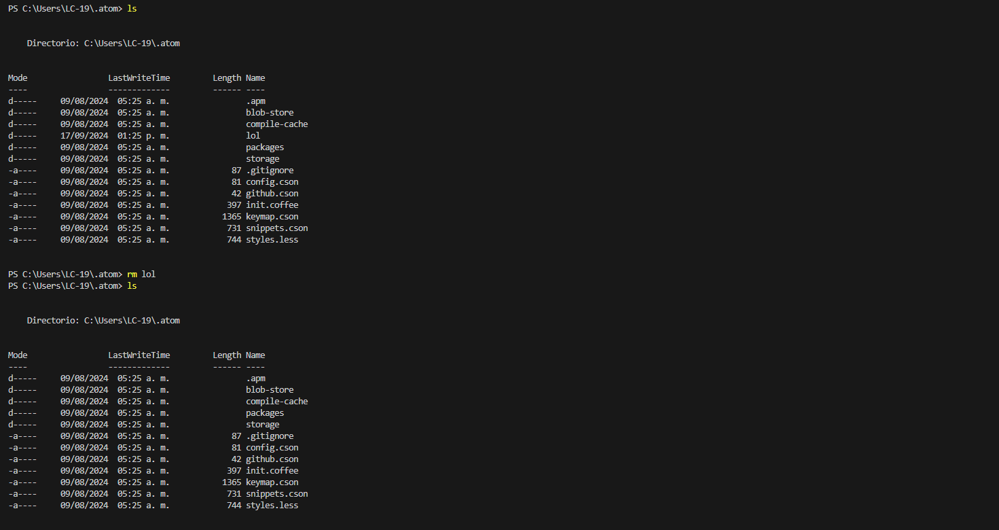

   <h1>Practicas de Comandos</h1>

  <h2>Evidencias</h2>
    
    
    
    

   <h2>Resumen de Comandos</h2>
   
En esta práctica hemos trabajado con los siguientes comandos de línea de comandos:

  <ul>
       <li><b>cd:</b> Este comando se utiliza para cambiar de directorio. Por ejemplo, "cd documentos" nos lleva a la carpeta "documentos".</li>
        <li><b>ls:</b> Muestra una lista del contenido de un directorio. Con él podemos ver los archivos y subdirectorios que hay en una carpeta.</li>
        <li><b>mkdir:</b> Sirve para crear un nuevo directorio. Por ejemplo, "mkdir nueva_carpeta" crea una carpeta llamada "nueva_carpeta".</li>
        <li><b>rm:</b> Se utiliza para eliminar archivos. Ten mucho cuidado al usar este comando, ya que los archivos eliminados no se pueden recuperar fácilmente Por ejemplo, "rm archivo.txt" elimina el archivo "archivo.txt".</li>
        <li><b>pwd:</b> Muestra la ruta completa del directorio actual en el que te encuentras.</li>
    </ul>

    
Estos comandos son fundamentales para navegar por el sistema de archivos y realizar diversas tareas en la línea de comandos.

